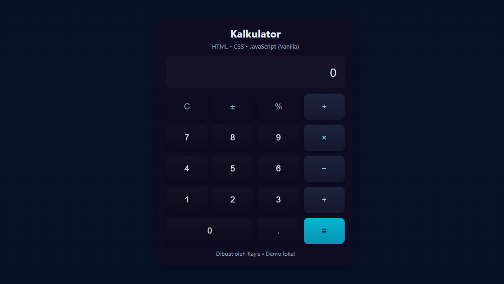

# Kalkulator Sederhana

<a href="index.html">DEMO</a>

## Description
Kalkulator Sederhana adalah aplikasi web berbasis **frontend-only** yang dibangun menggunakan HTML, CSS, dan vanilla JavaScript. Aplikasi ini dirancang untuk melakukan operasi aritmetika dasar seperti penjumlahan, pengurangan, perkalian, pembagian, persen, dan toggle tanda positif/negatif. Tampilan UI dibuat minimalis, responsif, dan mudah digunakan.

## Technologies Used
- **HTML5** untuk struktur halaman.
- **CSS3** untuk styling dan desain responsif.
- **Vanilla JavaScript (ES6)** untuk logika dan interaksi UI.

## Features
- Operasi dasar: `+`, `-`, `×`, `÷`, `%`.
- Tombol `C` untuk reset.
- Tombol `±` untuk toggle tanda positif/negatif.
- Tombol desimal `.` untuk angka pecahan.
- Keyboard support (angka, operator, Enter, Backspace, C).
- Tampilan responsif yang nyaman di desktop maupun mobile.

## Setup Instructions
1. Clone atau download repository ini.
2. Pastikan file berikut ada di folder proyek:
   - `index.html`
   - `style.css`
   - `script.js`
3. Buka file `index.html` langsung di browser (double-click atau drag ke browser).
4. Aplikasi siap digunakan tanpa perlu server atau backend.

## AI Support Explanation
Proyek ini dikembangkan dengan bantuan **AI (ChatGPT)** untuk:
- Merancang prompt detail pembuatan aplikasi kalkulator.
- Menghasilkan boilerplate code (HTML, CSS, dan JS).
- Menambahkan dokumentasi (`README.md`) dan panduan presentasi.

Semua kode tetap dapat dipelajari, dimodifikasi, dan dikembangkan lebih lanjut secara manual oleh developer. AI berperan sebagai **asisten coding** untuk mempercepat proses pengembangan.
